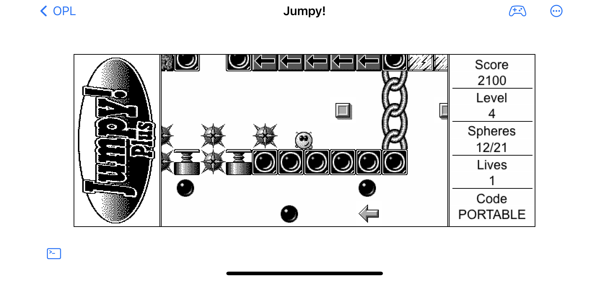
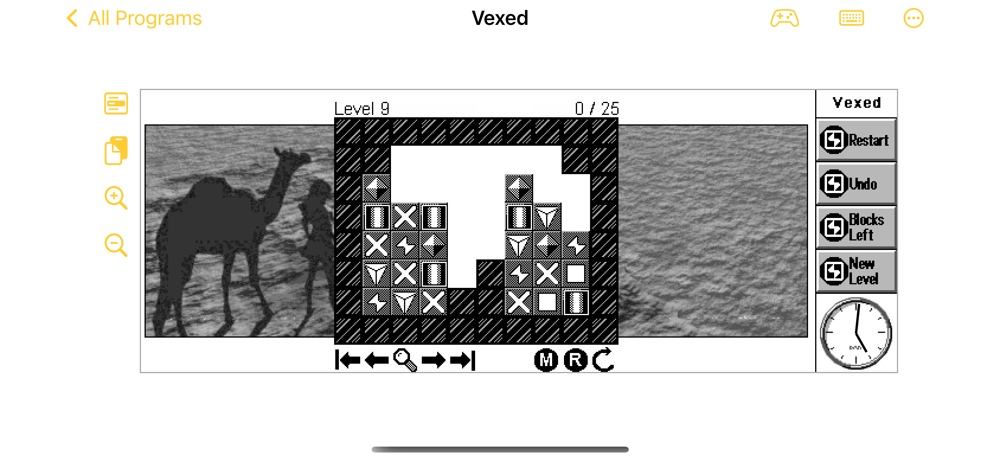
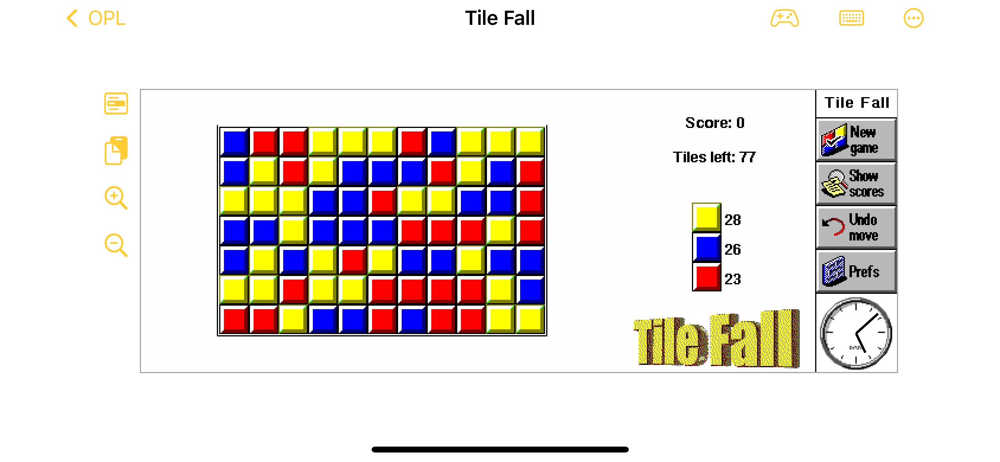

# OpoLua

[](https://github.com/inseven/opolua/actions/workflows/build.yaml)

An OPO (compiled OPL) interpreter written in Lua and Swift, based on the Psion Series 5 era format (ie ER5, prior to the Quartz 6.x changes). It lets you run Psion 5 programs written in OPL on any iOS device, subject to the limitations described below.

Supported features:

* Ability to decode a variety of Psion file types, including MBM, SIS, and database.
* SIS files can be installed directly by launching them.
* Colour graphics (if the program originally provided them).
* Sound.
* Limited game controller support - although a paired bluetooth keyboard is necessary for some programs that rely on the keyboard rather than touchscreen input.

One thing that is explicitly not supported is programs that aren't pure OPL - ie that are native ARM-format binaries. This project is an OPL interpreter only, it is not a full ARM virtual machine.

## Screenshots

Some example OPL programs downloaded from the internet, running in OpoLua on iOS:







## QCode

_Disclaimer: My understanding only, based on reading the opl-dev source code._

The OPL bytecode format is called QCode (due to the intermediary parsed code format being called PCode). It is a simple stack machine with variable length commands. Each command consists of an 8-bit opcode followed by variable length parameters. A command like "AddInt" is a single 8-bit opcode, which pops 2 values from the stack and pushes 1 result. The OPO file format defines a collection of procedures with metadata (such as number of arguments, required local variable stack frame size, etc) for each plus the QCode itself.

An "application" is an OPO file called "X.app" alongside a file "X.aif" (Application Info Format) describing the app's icons and localised name.

There are something like 280 defined opcodes, plus another 128 or so "functions" invoked with the `CallFunction` opcode. The distinction between dedicated opcode and function code appears entirely arbitrary as there are some extremely complex "opcodes" and some fairly basic functions codes. Opcodes whose numerical value doesn't fit in a single byte are expressed as opcode 255 ("NextOpcodeTable") followed by a second byte being the real code minus 256. There are no opcodes requiring more than 2 bytes to express.

Strings are limited to a maximum length of 255 bytes (this was increased in Quartz, as well as making strings support UCS-2). Various other internal data structures were increased from 1 byte to 2 at the same time. Strings not part of a string array have a maxlength byte preceding the length byte - string addresses always point to the length byte. String arrays have a single maxlength byte common to all elements, immediately preceding the first string element. For this reason opcodes that operate on strings take an explicit max length parameter on the stack, since it is not possible to know a string's max length based solely on its address (you need to know whether it's in an array or not, and if so where the start of the array is).

Arrays are limited to 32767 elements (signed 16-bit) although the overall local variable size of a function is also limited to something like 16KB. The array length is stored in the 2 bytes immediately preceding the first element (in the case of number arrays) or preceding the max length byte (in the case of string arrays). Array size is statically fixed at the point of declaration and cannot be changed at runtime. Array addresses always point to the start of the first element. Arrays are not first-class values (you cannot pass an array to a proc, or assign one array to another) but some commands do accept array parameters.

## Implementation notes

This interpreter largely ignores types and specific memory layout restrictions. The stack is represented with a simple Lua table containing Lua number or string values, with no strict distinction between words/longs/floats.

Right now it runs in minimal Lua 5.3 or 5.4 with bare bones I/O support (on any OS), or as a iOS Swift app with fairly comprehensive graphics support (which uses Lua 5.4).

Variables (ie, values not on the stack) are represented by a table of metatable type `Variable`. Calling `var()` gets the value, and calling `var(newVal)` sets it. In the case of array values, `Variable` also supports array indexing. Each item in the array is itself a `Variable`. To assign to the first item in an array variable, do `arrayVar[1](newVal)`.

In OpoLua v1.0 variables were represented solely by Lua data structures using `Variable` and a complex mapping and pseudo-allocator was maintained to support APIs like `ADDR()` and `PEEKB()`. In v1.1 this was rewritten (and simplified) so that all `Variables` are backed by a contiguous address space represented by `Chunk`, which allows more accurate emulation of things like out-of-bounds memory accesses which are technically undefined but many programs relied on how these behaved on real hardware. `Chunk` uses an array of Lua integers to represent the raw memory values, 4 bytes per integer. This allows the interpreter to function in pure-Lua mode while (in principle) allowing a more optimised native backing store.

This interpreter is not 100% behaviour compatible with the original Psion. The more relaxed typing will mean that code which errored on a Psion may execute fine on here. Equally, programs relying on undefined behaviour (like writing to freed memory, or abuse of the asynchronous APIs) may not run correctly. Any non-UB non-erroring program (which also doesn't rely on expecting errors to occur and trapping them) should run OK here. Except for...

**This is a work in progress!** See the next section for missing features.

## Missing features

* Various other less-common opcodes, functions and OPXes
* Some dialog features like dTIME, dFILE
* Invert drawing mode
* Ability to suspend/resume app execution in the iOS UI

## Example

[simple.txt](examples/Tests/simple.txt) compiled on a Psion Series 5:

```
$ ./src/runopo.lua --noget examples/Tests/simple.opo
Hello world!
Waaaat
(Skipping get)
$ ./src/dumpopo.lua examples/Tests/simple.opo --all
Source name: D:\Program
procTableIdx: 0x0000006B
1: TEST @ 0x0000001F code=0x00000036 line=0
    Subproc "WAT" offset=0x0012 nargs=0
    iTotalTableSize: 5 (0x00000005)
00000036: 2B [ConstantString] "Hello world!"
00000044: 8B [PrintString]
00000045: 92 [PrintCarriageReturn]
00000046: 53 [RunProcedure] 0x0012 (name="WAT" nargs=0)
00000049: 82 [DropFloat]
0000004A: 57 [CallFunction] 0x0A (Get)
0000004C: 80 [DropInt]
0000004D: 76 [ZeroReturnFloat]
2: WAT @ 0x0000004E code=0x00000060 line=6
    iTotalTableSize: 0 (0x00000000)
00000060: 2B [ConstantString] "Waaaat"
00000068: 8B [PrintString]
00000069: 92 [PrintCarriageReturn]
0000006A: 76 [ZeroReturnFloat]
$
```

## Compiling OPL

There is now support for compiling OPL code, although it is not (yet) integrated into the app. You must clone the repository from github and run the compiler from the command line. You must also have a version of Lua 5.3 or 5.4 installed from somewhere.

Syntax:

```
$ ./src/compile.lua <src> <output>
```

`src` can be either a text file, or a `.opl` file. OPL files can also be converted to text using `./src/opltotext.lua`.

The compiler supports most features of Series 5 era OPL, and will usually produce byte-for-byte identical output, compared with a Series 5. It tries to produce useful errors on malformed code, but it's likely there are some combinations that will produce something cryptic. Feel free to raise issues for these, or any examples where the output does not match the Series 5 compiler.

Unlike the original OPL compiler, which parsed the source code into an intermediate format "PCode" before then converting that to QCode, `compiler.lua` is a broadly single-pass compiler that directly generates QCode (with a final pass to fix up variable and branch offsets). Unlike the OpoLua interpreter, which in places has more relaxed runtime type checking than a Series 5, `compiler.lua` tracks expression types in exactly the same way as the original, including such quirks as `-32768` not being a valid integer literal (because internally it is parsed as the unary minus operator applied to 32768, and 32768 does not fit in an Integer).

The `runopo.lua` script now supports taking a text or `.opl` file as input - it will compile them automatically and then execute the result. Note that `runopo.lua` is only suitable for running programs that do not have any UI beyond `PRINT` statements.

### Compiler limitations

Compiling for the Series 3 target is not supported (aka SIBO or "OPL 1993").

Generating AIF files from a `APP...ENDA` section is not currently implemented.

The OPL compiler allows a maximum nesting of 8 IF/WHILE statements. There is no such limit in compiler.lua.

## Database format

_This is derived from [http://home.t-online.de/home/thomas-milius/Download/Documentation/EPCDB.htm](https://web.archive.org/web/20041130063903/http://home.t-online.de/home/thomas-milius/Download/Documentation/EPCDB.htm) with my own analysis added._

The base structure of a Database file (leaving aside the layers of implementation that leads to this format) is as follows. Broadly, the file is split into various sections, which are indexed via the TOC (Table Of Contents) section. The header of the file contains the location of the TOC.

Each section (except the header) also has a 2-byte length immediately preceding it, although these lengths are not necessary to parse the format, and are not always accurate (see [paging notes](#paging)). They are more an implementation detail. There are multiple other places where exact byte meanings are not known, and don't seem to affect the ability to parse the basic data from the file.

There are two different variable-length integer encodings used, in addition to the normal fixed-length little-endian representations. The first is what [Frodo Looijaard's docs](https://frodo.looijaard.name/psifiles/Basic_Elements) call 'extra' (or X) encoding. This is `TCardinality` in Epoc source code, and is a 1, 2 or 4 byte encoding depending on the bottom bits. See `readCardinality()` in `init.lua` for the details. This project's source will use 'cardinality' to refer to this type of encoding. The second is a 1 or 2 byte encoding which I couldn't find a reference for in public Epoc sources, and is referred to elsewhere as 'special' (or S) encoding. For want of a better name I use the same, see `readSpecialEncoding()` in `init.lua`. Where types are described below, `X` and `S` are used to refer to cardinality and and special encoding respectively.

`BString` refers to a string where the first byte indicates the length, and the string data follows. `SString` is similar but the length is either 1 or 2 bytes, encoded using the 'special' encoding described above. All strings are 8-bit, in Psion default system encoding (usually CP1252).

### Header

| Offset   | Type   | Name |
| ------   | ----   | ---- |
| 00000000 | uint32 | uid1 |
| 00000004 | uint32 | uid2 |
| 00000008 | uint32 | uid3 |
| 0000000C | uint32 | uidChecksum |
| 00000010 | uint32 | backup |
| 00000014 | uint32 | handle |
| 00000018 | uint32 | ref |
| 0000001C | uint16 | crc |

`backup`, `handle` and `ref` all relate to the table of contents, or TOC.

* If `handle` is non-zero, the TOC is located at file offset `file_length - (12 + 5 * handle)`.
* Otherwise, if `handle` is zero then the TOC should be located at `ref + 20`.
* But if `ref + 20` is greater than `file_length`, then the backup TOC should be used instead, located at `(backup >> 1) + 20`.

### TOC section

| Type       | Name |
| ----       | ---- |
| uint32     | `rootStreamIndex` |
| uint32     | `unknown` |
| uint32     | `count` |
| TocEntry[] | Array of `count` TocEntry structs follow |

`rootStreamIndex` is an index, describing which `TocEntry` points to the root stream section. It appears to always be 3.

Each `TocEntry` is 5 bytes, and contains the offset of a section, plus some flags that don't seem to be important. You must add 0x20 to `TocEntry.offset` to get the location in the file.


| Type   | Name |
| ----   | ---- |
| byte   | `flags` (usually zero) |
| uint32 | `offset` (add 0x20 to get file offset) |


The TOC is treated as a one-based array. The first few entries in the TOC always seem to refer to specific sections:

```
TocEntry[1] an uninteresting section, use unknown
TocEntry[2] table definition section
TocEntry[3] rootStream
TocEntry[4] first data section
```

Other sections may appear at indexes 5 and beyond - some unknown sections, and other data sections linked from the first (see below for description of how data sections link together).

A simple TOC might look something like this (taken from the output of `dumpdb.lua --verbose`):

```
000000D9 rootStreamIndex 00000003
000000DD unknown 00000000
000000E1 count 00000005
000000E5 TocEntry[1].flags 00
000000E6 TocEntry[1].offset 00000000
000000EA TocEntry[2].flags 00
000000EB TocEntry[2].offset 0000004D
000000EF TocEntry[3].flags 00
000000F0 TocEntry[3].offset 00000017
000000F4 TocEntry[4].flags 00
000000F5 TocEntry[4].offset 000000AD
000000F9 TocEntry[5].flags 00
000000FA TocEntry[5].offset 0000009E
```

### Table definition section

As linked from the TOC entry 2.

| Type   | Name |
| ----   | ---- |
| uint32 | `KDbmsStoreDatabase` (10000069) |
| byte   | nullbyte |
| uint32 | unknown |
| X      | `tableCount` (TCardinality) |
| ...    | `tableCount` Tables follow |

Each `Table` is:

| Type    | Name |
| ----    | ---- |
| SString | `tableName` |
| X       | `fieldCount` (TCardinality) |
| ...     | `fieldCount` Fields follow |
| uint16  | unknown |
| uint32  | unknown |

Each `Field` is:

| Type    | Name |
| ----    | ---- |
| SString | `fieldName` |
| byte    | `type` |
| byte    | unknown |
| byte    | `maxLength` (only present for text fields) |

The possible values for the `type` byte, and their meanings, are listed in the [Table Data section](#table-data-section).

### Table data section

Each table data section can contain up to 16 records, as given by the count of bits in `recordBitmask`. The next data section is given by `nextSectionIndex` which is an index into the TOC. It is zero if this is the last data section. The last data section may also have `nextSectionIndex` be non-zero but referring to a TOC entry whose offset is zero. As a special case, if in the first table data section (as referenced by `TocEntry[4]`) the bottom bit of `recordBitmask`, then that data section should be ignored and the data starts in the next section (as given by the first section's `nextSectionIndex`). It depends what app created the database file, as to whether the empty first section is present or not.

| Type    | Name |
| ----    | ---- |
| uint32  | `nextSectionIndex` |
| uint16  | `recordBitmask` (with `n` bits set) |
| ...     | Array of `n` `recordLength` (TCardinality) |

There is a `recordLength` for each set bit in `recordBitmask`. Each `recordLength` is a variable-length `TCardinality`.

After the record length array, the data for each record follows. The record data is a repeating sequence of `fieldMask` byte, followed by 1-8 fields of data (as determined by `fieldMask`), which repeat up to the limit of `recordLength`.

| Type | Name |
| ---- | ---- |
| byte | `fieldMask` |
| ...  | 1-8 fields follow |
| byte | another `fieldMask` |
| ...  | 1-8 more fields follow |
| ...  | _etc_ |

The order of fields is determined by the Table Definition Section. For example in a table with fields A, B and C, bit zero of `fieldMask` refers to A, bit one to B, bit two to C, and the field data would follow A then B then C. If a bit is not set in `fieldMask`, then that field data is not present (and should be considered default-initialized when read). Some field types consume an extra bit in `fieldMask` to encode their value or additional info, so it is necessary to carefully cross-reference against the table definition section when parsing `fieldMask` and the field data.

The reason for this encoding is to make records somewhat self-describing, so that appending an additional field does not need to re-encode existing records (an operation considered very costly on a Psion 5).

The format of the field data (and the type byte used in the table definition section) for each field type is as follows:

| Type      | Type byte | Format |
| ----      | --------- | ------ |
| `Boolean` | `00` | Value in next bit of `fieldMask` |
| `Integer` | `03` | 2 bytes, little-endian |
| `Long`    | `05` | 4 bytes, little-endian |
| `Double`  | `09` | 8 bytes, IEE754 format |
| `Date`    | `0A` | 8 bytes, see below |
| `Text`    | `0B` | `BString` |
| `Format`  | `10` | See below |

Fields other than `Integer`, `Long`, `Double` and `Text` are skipped over when decoded by OPL.

The `Date` type is ([apparently](https://web.archive.org/web/20041130063903/http://home.t-online.de/home/thomas-milius/Download/Documentation/EPCDB.htm); I haven't verified this myself) microseconds since 0000-01-01, applying Gregorian leap year rules from 1600 onward (ie leap century rules) and Julian leap year rules before that (ie every 4th year is a leap year). Ignoring the other nuances between the calendars. Which by my maths means divide by 1000000 and subtract `719540 * 86400` to convert to a unix-epoch (ie 1970) based date. 

The `Format` type consumes an additional bit in `fieldMask` - if this bit is 0, the field data is 4 bytes which is the index into the TOC of a format section. If the bit is 1, there is `Format` data included inline which I don't currently know how it's encoded. `database.lua` will error when attempting to parse such a `Format` field, because without knowing the format encoding and length it is not possible to continue parsing the record data.

It is not clear to me what happens if a `Boolean` or `Format` field ends up as the last bit in `fieldMask` (and thus there are no more bits left to consume) - `database.lua` will error if this occurs, please report it if you encounter this.

### Paging

Database files appear to have some sort of paging scheme whereby 2 extra bytes (some sort of tag?) are inserted every 0x4000 bytes, starting from 0x4020. These bytes aren't part of the format proper and must be stripped out before any of the indexes will be correct. All the documentation above assumes these extra bytes have been removed.

For some reason, when the extra bytes fall within a section, that section's prefix length bytes are zeroed - which is why relying on those lengths when parsing is a bad idea (for any file longer than 0x4020 bytes, at least).

## References

Various useful resources which aided greatly in reverse-engineering the OPL and EPOC environments:

* https://github.com/opl-dev/opl-dev
* https://web.archive.org/web/20070716134804/http://3lib.ukonline.co.uk/progindex.htm
* https://web.archive.org/web/20060505220702/http://www.allaboutopl.com/wiki/OPLCommandsListing?v=kbu
* https://thoukydides.github.io/riscos-psifs/sis.html
* http://www.koeniglich.de/epoc32_fileformats.txt
* https://frodo.looijaard.name/psifiles/MBM_File
* http://www.davros.org/psion/psionics/
* http://www.users.globalnet.co.uk/~datajam/opl-manual/html/opl/opchapt13.html
* https://web.archive.org/web/20041130063903/http://home.t-online.de/home/thomas-milius/Download/Documentation/EPCDB.htm

## Contributing

We invite and welcome contributions! There's a pretty comprehensive list of [issues](https://github.com/inseven/opolua/issues) to get you started, and our documentation is always in need of some care and attention.

Please recognise opolua is a labour of love, and be respectful of others in your communications. We will not accept racism, sexism, or any form of discrimination in our community.

## Licensing

opolua is licensed under the MIT License (see [LICENSE](LICENSE)).
